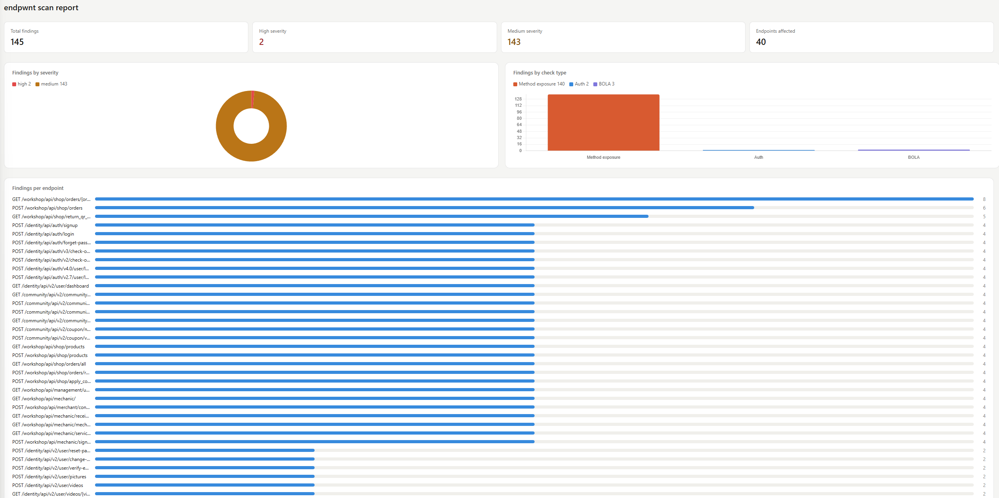

# endpwnt

**An auth-aware API endpoint security scanner for OpenAPI services.**

endpwnt ingests any OpenAPI 3.x specification, probes the described endpoints across multiple identity contexts, and emits a self-contained HTML dashboard of findings mapped to the OWASP API Security Top 10.

It was built to catch the class of API bugs that static analyzers and schema linters miss — the ones that only surface when you actually send requests under different auth identities and compare the results.

---

## Why

Most API scanners either treat every endpoint as anonymous (missing authorization bugs entirely), or fuzz blindly without understanding the documented contract.

endpwnt is *auth-aware*: every check runs against a configurable set of identity contexts — `unauth`, `user`, `admin`, or any custom role you define — and compares their behavior. That is the only way to catch bugs like broken object-level authorization, privilege escalation, and token-lifecycle weaknesses that dominate the OWASP API Top 10 but are invisible to request-replay tools.

## Features

- **OpenAPI-driven discovery.** Normalizes path, query, header, and body parameters across every documented operation — no manual route lists.
- **Pluggable check engine.** Checks subclass `BaseCheck` and are auto-discovered via reflection at runtime. Adding a new rule is a single class in one file, no registration or wiring.
- **Multi-identity request model.** Each check runs against every configured auth context (bearer tokens, cookies, custom headers), so privilege boundaries are actually tested, not assumed.
- **Self-contained HTML dashboard.** Findings roll up into severity, check-type, and per-endpoint charts (Chart.js), delivered as a single portable HTML file with no runtime dependency.
- **CI-ready.** `--fail-on {low,medium,high}` makes the scanner exit non-zero when findings cross a severity threshold, so it drops straight into a pipeline.
- **Validated against OWASP crAPI**, the reference intentionally-vulnerable API maintained by the same group behind the Top 10 spec.

## Checks and OWASP mapping

| Check ID           | What it tests                                                              | Maps to                       |
|--------------------|----------------------------------------------------------------------------|-------------------------------|
| `auth`             | Protected endpoints reachable without credentials                          | API2 — Broken Authentication  |
| `bola`             | Object IDs accessible across users via path / query mutation               | API1 — Broken Object Level Authorization |
| `method_exposure`  | HTTP verbs not documented in the spec but still handled by the server      | API8 — Security Misconfiguration |
| `error_leak`       | 5xx responses leaking framework, database, or stack-trace internals        | API8 — Security Misconfiguration |
| `token_lifecycle`  | Refresh / logout endpoints that fail to rotate or invalidate credentials   | API2 — Broken Authentication  |

## Quickstart

Install:

```bash
pip install -e .
```

Write a `config.yaml` pointing at your OpenAPI spec and declaring the identities you want to test as:

```yaml
base_url: "http://localhost:8888"

auth_contexts:
  - name: "unauth"
  - name: "user"
    headers:
      Authorization: "Bearer <user jwt>"
  - name: "admin"
    headers:
      Authorization: "Bearer <admin jwt>"

endpoint_sources:
  openapi: "crapi-openapi-spec.yaml"
  exclude_paths:
    - "/identity/api/auth/signup"
    - "/identity/api/auth/login"

checks:
  enabled: ["auth", "bola", "error_leak", "method_exposure", "token_lifecycle"]
  candidate_param_names: ["id", "userId", "vehicleId"]
  test_values: ["1", "2"]
```

Run:

```bash
endpwnt --config config.yaml --output report.html --fail-on high
```

The scanner resolves the spec path relative to the config file, enumerates every operation, runs each enabled check against every applicable endpoint, and writes a standalone HTML dashboard. Exit code is non-zero when any finding meets the `--fail-on` severity threshold.

## Architecture

```
src/endpwnt/
├── cli.py            # argparse entrypoint
├── scanner.py        # orchestrator: loads config + spec, discovers + runs checks
├── parse_config.py   # typed config dataclasses
├── endpoint.py       # normalized Endpoint model built from OpenAPI operations
├── client.py         # session-backed HTTP client with per-context auth injection
├── base_check.py     # BaseCheck ABC and shared probing helpers
├── checks.py         # concrete check implementations
├── finding.py        # Finding dataclass — the unit of output
└── html_reporter.py  # self-contained HTML + Chart.js renderer
```

The scanner is a thin orchestrator: it reflects over `checks.py`, instantiates every subclass of `BaseCheck`, and applies the ones enabled in config to every endpoint where `applies_to()` returns True. Config, HTTP, check logic, and reporting are deliberately isolated so individual pieces can evolve — or be swapped — independently.

## Writing a new check

```python
class MassAssignmentCheck(BaseCheck):
    check_id = "mass_assignment"

    def applies_to(self, endpoint: EndPoint) -> bool:
        return endpoint.method in {"POST", "PUT", "PATCH"} and endpoint.request_body is not None

    def run(self, endpoint, client, auth_contexts, options) -> list[Finding]:
        # inject fields the schema doesn't declare and look for them echoed back
        ...
```

That is the entire integration. `applies_to()` keeps the check scoped; `run()` receives the HTTP client, every configured identity, and the options dict from `config.yaml`, so rules stay stateless and unit-testable.

## Sample output

The HTML report includes:

- Top-line metric cards (total findings, high severity, medium severity, endpoints affected)
- Severity doughnut + check-type bar chart
- Per-endpoint finding distribution
- Expandable finding cards with evidence and a remediation recommendation




## Roadmap

- Additional checks: mass assignment, rate-limit probing, CORS misconfiguration, SSRF reflection
- SARIF and JUnit exporters for GitHub code scanning and GitLab pipeline integration
- Snapshot diffing so CI can surface *new* findings only
- Automated fixture discovery: create a user + admin pair against supported auth flows instead of requiring pre-minted tokens

## License

MIT.
